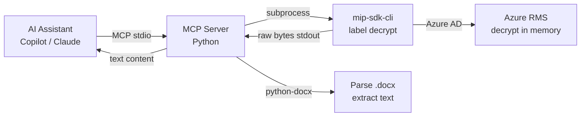
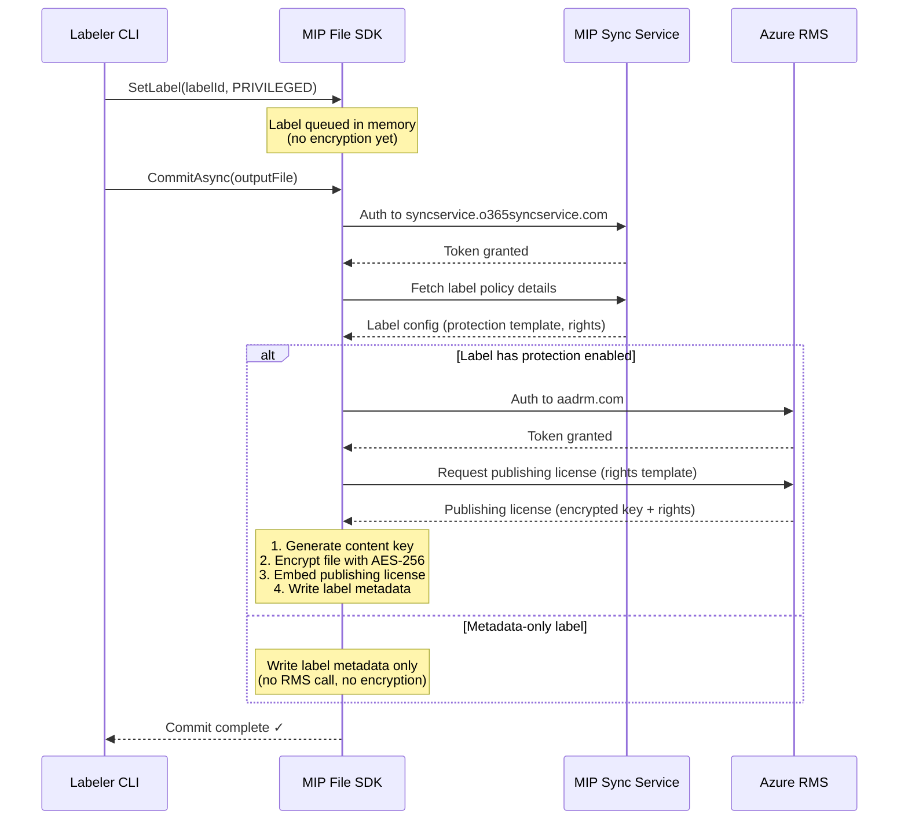

# Microsoft Purview MIP SDK Sample

A two-part sample demonstrating Microsoft Information Protection (MIP) capabilities:

1. **MIP SDK CLI** (C++) — Apply, read, remove, and decrypt sensitivity labels on files using the MIP File SDK
2. **MCP Server** (Python) — Exposes MIP-protected document reading as tools for AI assistants (GitHub Copilot, Claude, etc.)
3. **Scanner** (Python) — Scan file content against Purview data protection policies using the Microsoft Graph `processContent` API

The two parts are connected: the scanner reads the labeled file output from the labeler and evaluates it against configured policies.

---

## Prerequisites

| Requirement | Details |
|---|---|
| **Microsoft 365** | E3 or E5 subscription with sensitivity labels configured |
| **MIP SDK** | [Download](https://aka.ms/mipsdkbins) the macOS C++ SDK and extract it |
| **CMake** | 3.16+ (`brew install cmake`) |
| **Xcode CLI tools** | `xcode-select --install` |
| **Python** | 3.9+ with pip |
| **OpenSSL / cURL** | Typically pre-installed on macOS |

## Microsoft Entra App Registration

Register an app in [Microsoft Entra ID](https://portal.azure.com/#blade/Microsoft_AAD_IAM/ActiveDirectoryMenuBlade/RegisteredApps):

1. **Supported account types**: Accounts in this organizational directory only
2. **Redirect URI**: Public client — `http://localhost`
3. **API Permissions**:

   **Delegated permissions:**
   - `Azure Rights Management Services` → `user_impersonation`
   - `Microsoft Information Protection Sync Service` → `UnifiedPolicy.User.Read`

   **Application permissions:**
   - `Azure Rights Management Services` → `Content.SuperUser` (read all protected content)
   - `Azure Rights Management Services` → `Content.Writer` (create protected content)
   - `Azure Rights Management Services` → `Content.DelegatedWriter` (create protected content on behalf of a user)
   - `Azure Rights Management Services` → `Content.DelegatedReader` (read protected content on behalf of a user)
   - `Microsoft Graph` → `Content.Process.All` (for the Python scanner)
4. **Grant admin consent** for all permissions
5. Create a **Client Secret** (for the Python scanner)

Note the **Application (client) ID**, **Directory (tenant) ID**, and **Client Secret**.

---

## Setup

```bash
# Clone the repo
git clone <this-repo-url>
cd purview-mip-sdk-sample

# Create .env from template
cp .env.example .env
# Edit .env with your values: TENANT_ID, CLIENT_ID, CLIENT_SECRET, USER_EMAIL, USER_ID, LABEL_ID
```

---

## Part 1: C++ MIP SDK CLI

### Build

**Native (macOS with MIP SDK):**

```bash
cd labeler
mkdir -p build && cd build
cmake -DMIP_SDK_PATH=/path/to/mip_sdk -DCOMPILE_ONLY=OFF ..
cmake --build .
# Executable: ./mip-sdk-cli
```

**Docker (Linux x86-64):**

```bash
cd purview-mip-sdk-sample
docker build --platform linux/amd64 -t mip-sdk-cli -f labeler/Dockerfile .
```

### Usage

The CLI reads credentials from a `.env` file automatically. Create your `.env` file first:

```bash
cp .env.example .env
# Edit .env with your real values
```

**`.env` file format:**
```env
# Microsoft Entra App Registration
CLIENT_ID=your-client-id
TENANT_ID=your-tenant-id
CLIENT_SECRET=your-client-secret

# User identity
USER_EMAIL=user@tenant.com
```

The CLI looks for `.env` in the current directory by default. Use `--env <path>` to specify a different location. CLI arguments always override `.env` values.

**Label commands:**

```bash
# List available sensitivity labels
./mip-sdk-cli label list

# Apply a sensitivity label to a file
./mip-sdk-cli label set --input test.docx --output labeled.docx --label-id <guid>

# Read the label from a file
./mip-sdk-cli label get labeled.docx

# Remove a label from a file
./mip-sdk-cli label remove --input labeled.docx --output clean.docx

# Decrypt a protected file to stdout (in-memory — no file written to disk)
./mip-sdk-cli label decrypt protected.docx > decrypted.docx

# Use a specific .env file
./mip-sdk-cli --env /path/to/.env label list
```

**Policy commands:**

```bash
# List label policies
./mip-sdk-cli policy list
```

**Docker usage:**

```bash
# List labels via Docker
docker run --rm --platform linux/amd64 \
    -v "$(pwd)/.env:/app/.env:ro" \
    mip-sdk-cli label list

# Apply a label via Docker
docker run --rm --platform linux/amd64 \
    -v "$(pwd)/.env:/app/.env:ro" \
    -v "$(pwd)/sample_files:/data" \
    mip-sdk-cli label set --input /data/test_clean.docx \
    --output /data/test_labeled.docx --label-id <guid>
```

---

## Part 2: MCP Server (AI Assistant Integration)

An [MCP (Model Context Protocol)](https://modelcontextprotocol.io/) server that lets AI assistants read MIP-protected documents. Decrypted content stays in memory — no unprotected file is ever written to disk.

### Architecture



### Setup

```bash
# Install dependencies (Python 3.10+)
pip install -r mcp-server/requirements.txt
```

### Tools

| Tool | Input | Output |
|------|-------|--------|
| `list_labels` | — | All sensitivity labels in the organization |
| `get_doc_label` | file path | Label name and ID applied to a file |
| `read_protected_doc` | file path | Decrypted text content of a protected .docx |

### VS Code Configuration

Create `.vscode/mcp.json` in the workspace root:

```json
{
  "servers": {
    "mip-reader": {
      "type": "stdio",
      "command": "python3",
      "args": ["${workspaceFolder}/mcp-server/server.py"]
    }
  }
}
```

Then in VS Code:
1. `Cmd+Shift+P` → **MCP: List Servers** → start **mip-reader**
2. Open Copilot Chat in **Agent** mode
3. Ask: *"Use the read_protected_doc tool to read my protected document"*

### Security Model

- **Identity**: The user email is locked to `USER_EMAIL` in `.env` — it is never accepted from the AI assistant, preventing impersonation.
- **In-memory decryption**: The MIP SDK decrypts to a memory stream (`MemoryStream` class). No temp file is created.
- **Audit**: The MIP SDK automatically logs all access events to the Microsoft Purview unified audit log. Verify in Purview portal → Audit.
- **Permissions**: Uses `Content.DelegatedReader` for per-user access control, or `Content.SuperUser` for admin-level access.

---

## Part 3: Python Scanner (Graph processContent API)

### Setup

```bash
cd scanner
python3 -m venv .venv
source .venv/bin/activate
pip install -r requirements.txt
```

### Usage

```bash
# Scan the labeled file against Purview DLP policies
python scan_content.py --file ../sample_files/test_labeled.txt --env ../.env
```

### What it does

1. Reads the file content as UTF-8 text
2. Acquires a token via MSAL client credentials flow
3. Calls `POST /users/{userId}/dataSecurityAndGovernance/processContent` with the file content
4. Displays policy actions (block, audit, etc.) returned by Purview

### Example Output

```
Reading file: ../sample_files/test_labeled.txt
  File size: 423 bytes
Acquiring access token...
  Token acquired successfully.
Sending processContent request to Microsoft Graph...

============================================================
  processContent Scan Results
  File: ../sample_files/test_labeled.txt
============================================================

  Protection Scope State: modified

  Policy Actions (1):
    - restrictAccessAction: restrictAccess -> block

  Processing Errors: None

============================================================
```

---

## End-to-End Walkthrough

```bash
# 0. Set up your credentials
cp .env.example .env
# Edit .env with your CLIENT_ID, TENANT_ID, CLIENT_SECRET, USER_EMAIL

# 1. Build the CLI
cd labeler/build
cmake -DMIP_SDK_PATH=/path/to/mip_sdk -DCOMPILE_ONLY=OFF ..
cmake --build .

# 2. Label a file
./mip-sdk-cli --env ../../.env label set \
    --input ../../sample_files/test_clean.docx \
    --output ../../sample_files/test_labeled.docx \
    --label-id <label-guid>

# 3. Read the label back
./mip-sdk-cli --env ../../.env label get ../../sample_files/test_labeled.docx

# 4. Scan the labeled file with processContent
cd ../../scanner
source .venv/bin/activate
python scan_content.py --file ../sample_files/test_labeled.docx --env ../.env
```

---

## How Protection-Enabled Labels Work

Sensitivity labels come in two types:

| Label Type | Example | Behavior |
|---|---|---|
| **Metadata-only** | General, Confidential → Anyone (unrestricted) | Stamps label metadata into the file. No encryption. Anyone can open. |
| **Protection-enabled** | Confidential → All Employees, Highly Confidential | Encrypts file content via Azure RMS. Only authorized users can open. |

### Encryption Flow

When you apply a protection-enabled label, encryption happens during `CommitAsync`:



The second auth challenge to `aadrm.com` **only appears when the label includes protection**. For "unrestricted" labels, only the sync service call is made.

### File Format Requirements

- **`.docx`, `.xlsx`, `.pptx`, `.pdf`**: Support both metadata-only and protection-enabled labels
- **`.txt` and other plain text**: Can only be labeled with protection (encryption) — metadata-only labels will fail because plain text has no metadata container

### Required Permissions for Protection

To apply protection-enabled labels, your app registration needs these **Application permissions** on `Azure Rights Management Services`:

| Permission | Purpose |
|---|---|
| `Content.SuperUser` | Read all protected content in the tenant |
| `Content.Writer` | Create protected content |
| `Content.DelegatedWriter` | Create protected content on behalf of a user |
| `Content.DelegatedReader` | Read protected content on behalf of a user |

Without these permissions, applying a protection-enabled label will fail with `ServiceDisabledError`.

---

## Project Structure

```
purview-mip-sdk-sample/
├── .env.example                          # Config template
├── .gitignore
├── README.md
├── labeler/                              # C++ MIP SDK CLI
│   ├── CMakeLists.txt
│   ├── Dockerfile
│   └── src/
│       ├── main.cpp                      # CLI entry point (label/policy subcommands)
│       ├── action.h / action.cpp         # MipContext → Profile → Engine → Handler
│       ├── memory_stream.h              # In-memory mip::Stream for decryption
│       ├── auth_delegate.h / .cpp        # OAuth2 token acquisition (client credentials)
│       ├── consent_delegate.h / .cpp     # Consent delegate (auto-accept)
│       ├── profile_observer.h / .cpp     # FileProfile async observer
│       └── file_handler_observer.h / .cpp# FileHandler async observer
├── mcp-server/                           # MCP server for AI assistants
│   ├── requirements.txt
│   └── server.py                         # MCP tools: read_protected_doc, get_doc_label, list_labels
├── scanner/                              # Python Graph API scanner
│   ├── requirements.txt
│   └── scan_content.py                   # processContent API caller
└── sample_files/
    └── test_clean.docx                   # Sample file for labeling
```

## References

- [MIP SDK Setup & Configuration](https://learn.microsoft.com/en-us/information-protection/develop/setup-configure-mip)
- [MIP SDK File Handler Concepts (C++)](https://learn.microsoft.com/en-us/information-protection/develop/concept-handler-file-cpp)
- [Quickstart: Set and Get a Sensitivity Label (C++)](https://learn.microsoft.com/en-us/information-protection/develop/quick-file-set-get-label-cpp)
- [Graph API: processContent](https://learn.microsoft.com/en-us/graph/api/userdatasecurityandgovernance-processcontent?view=graph-rest-1.0)
- [Azure-Samples/MipSDK-File-Cpp-Basic](https://github.com/Azure-Samples/MipSDK-File-Cpp-Basic)
