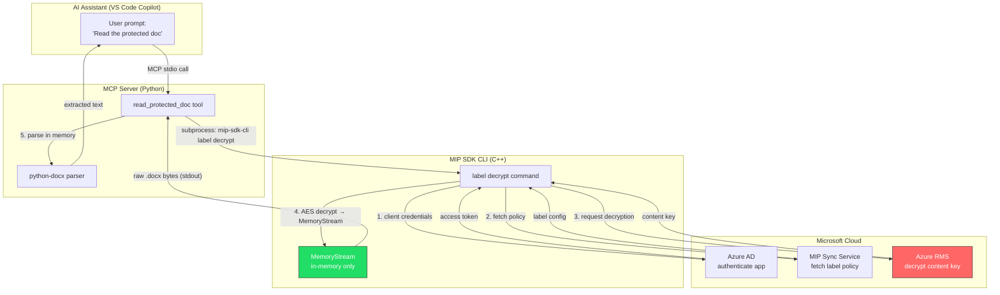
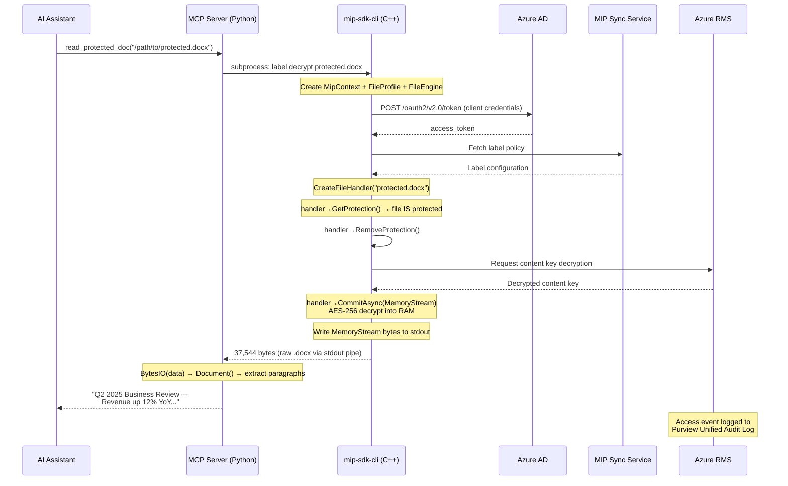
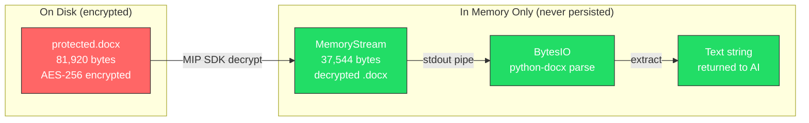

# Scenario: Reading Protected Documents via MCP Server

This document demonstrates how an AI assistant (GitHub Copilot, Claude, etc.) can read
sensitivity-labeled and encrypted documents through the MIP Document Reader MCP server,
with all decryption happening in memory — no unprotected file ever touches disk.

---

## Architecture Overview



---

## Data Flow Detail



---

## Real Execution Logs

### Step 1: List available sensitivity labels

```
$ ./mip-sdk-cli --env ../.env label list

MIP SDK initialized successfully for user: Frank@aprforazure.onmicrosoft.com

Sensitivity labels for your organization:
==========================================
Personal : defa4170-0d19-0005-0000-bc88714345d2
Public : defa4170-0d19-0005-0001-bc88714345d2
General : defa4170-0d19-0005-0002-bc88714345d2
  -> Anyone (unrestricted) : defa4170-0d19-0005-0003-bc88714345d2
  -> All Employees (unrestricted) : defa4170-0d19-0005-0004-bc88714345d2
Confidential : defa4170-0d19-0005-0005-bc88714345d2
  -> Anyone (unrestricted) : defa4170-0d19-0005-0006-bc88714345d2
  -> All Employees : defa4170-0d19-0005-0007-bc88714345d2
  -> Trusted People : defa4170-0d19-0005-0008-bc88714345d2
Highly Confidential  : defa4170-0d19-0005-0009-bc88714345d2
  -> All Employees : defa4170-0d19-0005-000a-bc88714345d2
  -> Specific People : defa4170-0d19-0005-000b-bc88714345d2
```

### Step 2: Check the label on the protected file

```
$ ./mip-sdk-cli --env ../.env label get test_confidential_protected.docx

Reading label from: test_confidential_protected.docx
  Name : All Employees
  Id   : defa4170-0d19-0005-0007-bc88714345d2
```

The file has the **Confidential → All Employees** label applied, which includes Azure RMS encryption.

### Step 3: Attempt to read without MIP SDK

```python
>>> data = open('test_confidential_protected.docx', 'rb').read()
>>> len(data)
81920
>>> data[:16].hex()
'd0cf11e0a1b11ae10000000000000000'
# OLE Compound Document header — content is AES encrypted inside
# Cannot extract any text without decryption
```

The file is 81,920 bytes of encrypted OLE compound data. No text is readable.

### Step 4: Decrypt via MIP SDK CLI (in-memory)

```
$ ./mip-sdk-cli --env ../.env label decrypt test_confidential_protected.docx > /dev/null

  Auth challenge:
    Authority: https://login.windows.net/common
    Resource : https://syncservice.o365syncservice.com/
  Token acquired via client credentials.
MIP SDK initialized successfully for user: Frank@aprforazure.onmicrosoft.com
File is protected. Decrypting in memory...
Decrypted 37544 bytes to stdout.
```

The MIP SDK:
1. Authenticates with Azure AD using client credentials
2. Contacts Azure RMS to obtain the content decryption key
3. Decrypts the AES-256 encrypted content into a `MemoryStream` (RAM only)
4. Writes 37,544 bytes of clean .docx data to stdout
5. **No temp file is created — decrypted content never touches disk**

### Step 5: MCP Server parses the decrypted content

```
Received 37544 bytes from CLI
Valid .docx (ZIP): True
Paragraphs: 1
Content: Q2 2025 Business Review — Revenue up 12% YoY. All regions on track.
```

The MCP server:
1. Captures the raw stdout bytes from the CLI subprocess
2. Wraps them in a `BytesIO` buffer (still in memory)
3. Parses with `python-docx` — validates the ZIP header (`504b0304`)
4. Extracts paragraph text
5. Returns the plain text to the AI assistant

### Step 6: AI assistant receives the content

In Copilot Chat (Agent mode):

```
User: "Use the read_protected_doc tool to read test_confidential_protected.docx"

Copilot: The protected document contains:
  "Q2 2025 Business Review — Revenue up 12% YoY. All regions on track."
```

---

## Security Controls

### What stays in memory



| Control | Implementation |
|---------|---------------|
| **No file on disk** | `MemoryStream` class implements `mip::Stream` in RAM. `CommitAsync(memStream)` never writes to a file. |
| **Identity locked** | `USER_EMAIL` comes from `.env` config, never from the AI assistant. Prevents impersonation. |
| **Permission enforcement** | With `Content.DelegatedReader`, Azure RMS checks if the configured user has `View` rights on the document. Access denied if not authorized. |
| **Audit trail** | MIP SDK automatically logs access events to Microsoft Purview unified audit log. Searchable in Purview portal → Audit. |
| **Pipe isolation** | Decrypted bytes flow through a Unix pipe (stdout) from C++ to Python. The pipe buffer is kernel-managed memory, not a file. |

### File size comparison

| Stage | Size | Format |
|-------|------|--------|
| Protected file on disk | 81,920 bytes | OLE Compound Document (AES encrypted) |
| Decrypted in memory | 37,544 bytes | Valid .docx (ZIP with XML) |
| Extracted text | 68 bytes | Plain text |

---

## Audit Verification

MIP SDK audit events appear in the Microsoft Purview unified audit log:

1. Go to **https://compliance.microsoft.com/auditlogsearch**
2. Search with:
   - **Date range**: Last 7 days
   - **Activities**: All activities
   - **Record type**: `MipLabel` or `AipDiscover`
3. Look for entries from app ID `46946ac6-1560-4928-a748-1c4a353fce44`

Expected audit fields:

| Field | Value |
|-------|-------|
| Activity | SensitivityLabeledFileOpened / FileAccessed |
| User | App service principal |
| Application | MIP-SDK-CLI (46946ac6-...) |
| File | test_confidential_protected.docx |
| Label | Confidential → All Employees |
| Action | Decrypt / View |

---

## Configuration Reference

### `.env` (credentials — gitignored)
```env
CLIENT_ID=your-client-id
TENANT_ID=your-tenant-id
CLIENT_SECRET=your-client-secret
USER_EMAIL=user@tenant.com
```

### `.vscode/mcp.json` (MCP server config)
```json
{
  "servers": {
    "mip-reader": {
      "type": "stdio",
      "command": "python3",
      "args": ["${workspaceFolder}/mcp-server/server.py"]
    }
  }
}
```

### Azure App Registration Permissions

| API | Permission | Type | Purpose |
|-----|-----------|------|---------|
| Azure Rights Management Services | `Content.DelegatedReader` | Application | Read protected content on behalf of a user |
| Azure Rights Management Services | `Content.DelegatedWriter` | Application | Create protected content on behalf of a user |
| Azure Rights Management Services | `Content.SuperUser` | Application | Read all protected content (admin override) |
| Azure Rights Management Services | `Content.Writer` | Application | Create protected content |
| Microsoft Information Protection Sync Service | `UnifiedPolicy.User.Read` | Delegated | Read label policies |
